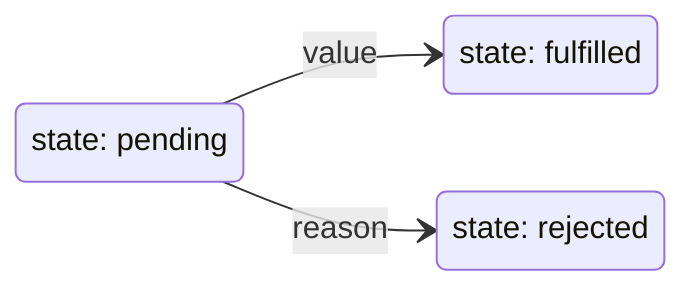

## Promises/A+

<v-clicks depth="1">

- 符合 Promises/A+ 规范的 promise 表示异步操作的最终结果
- 是一个具有 `then` 方法的对象或者函数，该 promise 的 then 方法的行为符合规范
- 必须处于以下三种状态之一
  - pending：表示 promise 状态待定，允许转换为另两种状态
  - fulfilled：表示 promise 已被满足，有一个结果值(value)，不允许改变状态
  - rejected：表示 promise 已被拒绝，有一个拒因(reason)，不允许改变状态

</v-clicks>

